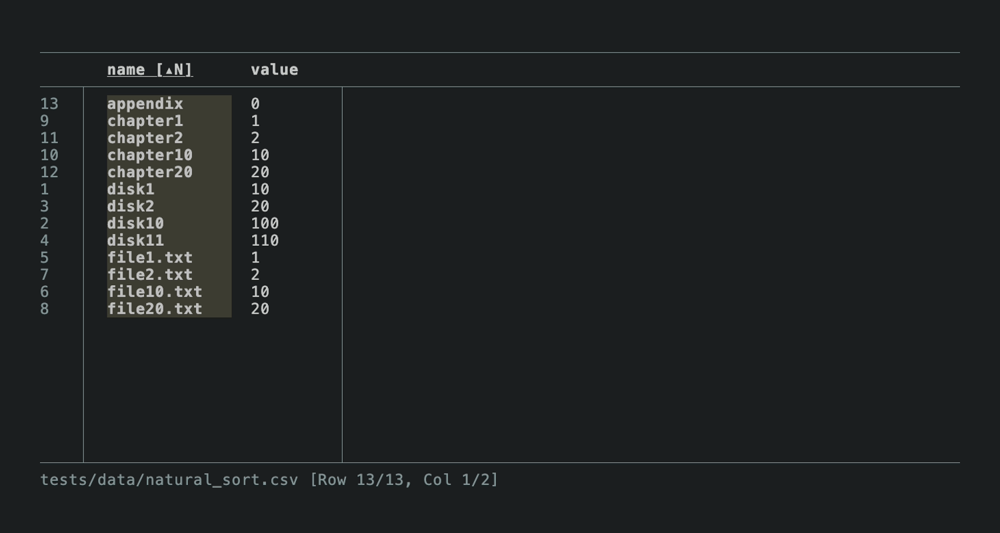
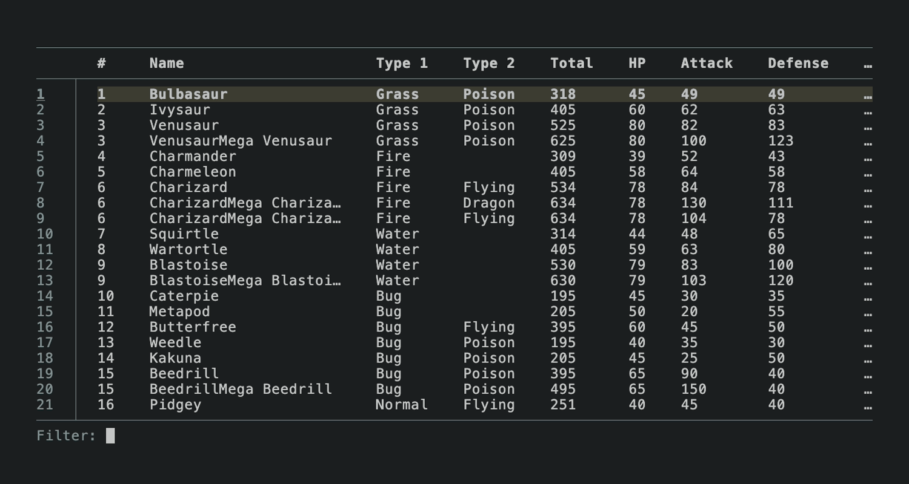
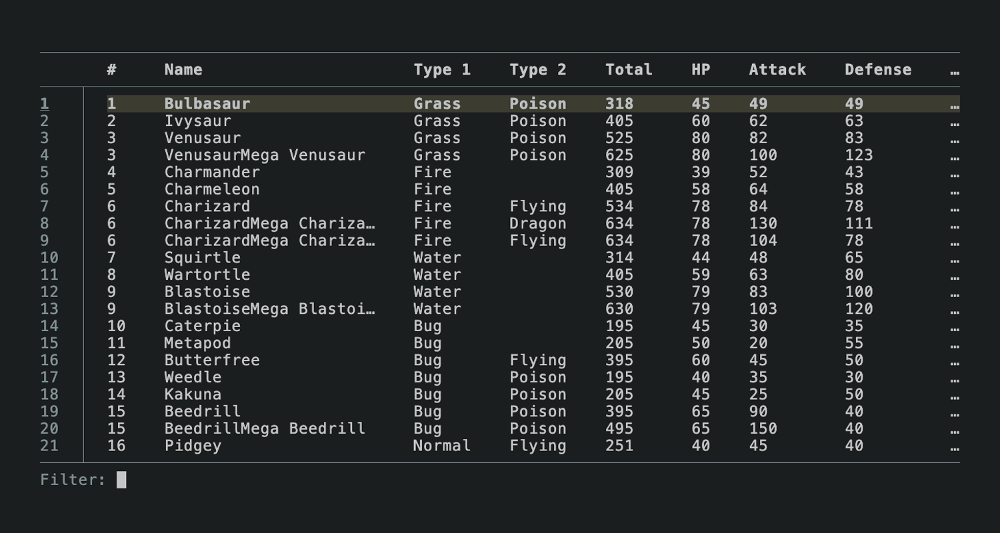

# v0.15.1

* Fix potential blank table when streaming input from stdin (#183)
* Fix incorrectly truncated fields when search regex is empty (#184)

# v0.15.0

* Add `--auto-reload` option to automatically reload content on file change (#79)
* Stream data from stdin by default (disable with `--no-streaming-stdin`) (#81)
* Support visually marking rows (toggle: `m`; clear all marks: `M`) (#166 by @giantatwork)
* Preserve selected row after filter is cleared (#170)
* Fix search from current cursor for larger files (#165)
* Fix row selection when scrolling to rows near bottom (#168)
* Fix potential freeze when the underlying file changes unexpectedly

# v0.14.0

* Support natural sorting via `Ctrl + j` (#143 by @jqnatividad):

  

* Add `--wrap chars` (or `-S`) and `--wrap words` (or `-W`) options to set the default wrapping mode

* Make auto-delimiter the default. Use `-c` or `--comma-separated` to force a comma delimiter (#51)

* Find command now searches from the current cursor (#14)

* Reduce flicker at the start of filtering. Before:

  

  After:

  

* Fix copying cells containing CRLF (#151)

# v0.13.0

* Add `--color-columns` to display each column in a different color (#39)
* Add `--prompt` to show a custom prompt message in the status bar (#135)
* Expose freeze columns option in library usage (#124 by @jqnatividad)
* Improve visibility of line numbers and borders
* Add `aarch64` release targets (#55)

# v0.12.0

* Freeze first `n` columns when scrolling via `f<n>` (#62, #117)
* Support searching in header row (#102)
* Support moving find mode cursor horizontally via `n` / `N`
* Support library usage without clap dependency (#118 by @jqnatividad)
* Fix search highlighting when columns are filtered
* Fix column scrolling for CSV with irregular last row (#99)

# v0.11.0

* Support copying a row to the clipboard (#97 by @mendelmaleh)
* Improve rendering performance by using line-buffered `stderr` (#107)
* Fix panic when filtering columns with irregular CSV (#112 by @antmelon)
* Disable `arboard` default features to reduce image related dependencies (#114 by @jqnatividad)
* Improve test stability across different environments (#101)

# v0.10.1

* Fix `--echo-column` option error

# v0.10.0

* Improve horizontal space utilization when rendering wide columns
* Support toggling sort direction
* Accept tab delimiter specified as `-d \t` without quotes
* Add library target

# v0.9.1

## Bug fixes

* Fixed issue with finding and filtering using an empty cell leading to incorrect matches
* Fixed certain Shift key-related key bindings not functioning correctly on Windows (Issue #82)

# v0.9.0

* Improve scrolling responsiveness for large csv
* Find and filter using selected cell (`#` and `@`) to search for exact matches
* Fix rendering of cursor in input prompt
* Fix app freeze on line wrap in some cases
* Fix potential overflow when subtracting durations in Windows (#77)
* Fix rendering of right border with irregular columns (#73)
* Fix misspelling ([#72](https://github.com/YS-L/csvlens/pull/72) by @theKnightsOfRohan)

# v0.8.1

* Fix rendering of consecutive newlines
* Fix clipboard support on Wayland (@ram02z)
* Allow opting out of clipboard feature

# v0.8.0

This release adds support for the following:

* Find and filter within the selected column
* Find and filter using the selected cell (`#` and `@`)
* Wrap lines by words (toggled via `-W`)
* Copy selected cell to clipboard (`y`)

# v0.7.0

* Support sorting rows by a column (`Shift + ↓` or `Shift + j`)
* Support CSV without headers via `--no-headers`
* Add `--columns`, `--filter`, and `--find` options for filtering rows and columns

# v0.6.0

* Accept `"\t"` for tab as delimiter argument ([#49](https://github.com/YS-L/csvlens/pull/49) by @peterjc)
* Add `-t` flag for tsv files ([#47](https://github.com/YS-L/csvlens/pull/47) by @JojiiOfficial)
* Print lower level causes on error

# v0.5.1

* Fix panic caused by unicode and newline

# v0.5.0

* Migrate to Ratatui ([#42](https://github.com/YS-L/csvlens/pull/42) by @joshka)
* Better readline support using tui-input (move cursor forward / backward, jump to the start, etc)
* Improve buffer history to retrieve more than just the last input

# v0.4.0

This release adds support for the following:

* Show help page with key bindings (`H`)
* Scroll to left most and right most columns (`Ctrl + ←`  or `Ctrl + →`)
* Scroll forward and backward half a window (`Ctrl + d` or `Ctrl + u`)
* Resize columns (`<` or `>`)
* Reset to default view (`r`)

# v0.3.2

* Fix incorrectly truncated content due to highlighting
* Fix potential overflow panic

# v0.3.1

* Fix panic due to unicode handling
* Fix row height calculation to account for column widths properly
* Reduce maximum column width fraction to make more columns visible

# v0.3.0

* Support line wrapping for displaying long or multiline content

# v0.2.0

* Add `-d auto` option to auto-detect delimiter
* Add `Home` and `End` key bindings
* Support row, column and cell selection modes (toggle via `TAB`)

# v0.1.14

* Implement --ignore-case option
* Fix crossterm double input issue on Windows

# v0.1.13

* Switch to Rust 2021 edition and update dependencies (#25)
* Fix crossterm panic by upgrading to version 0.26.1
* New styling for selected row

# v0.1.12

* Add --version option
* Add --echo-column option to print column's value at selected row to stdout
* Use stderr as tui buffer to support piping from csvlens

# v0.1.11

* Attempt to restore terminal state on panic
* Fix piped input not working on macOS

# v0.1.10

* Handle irregular CSV when calculating column widths
* Improved event loop handling
* Improved memory usage when creating temporary file from stdin

# v0.1.9

* Support filtering on columns
* Support basic command history

# v0.1.8

* Support horizontal scrolling

# v0.1.7

* Ensure terminal state is restored on error

# v0.1.6

* Fix bug where program sometimes crashes due to unicode characters
* Switch to `crossterm`

# v0.1.5

* Support irregular CSV to some extent (parse CSV in non-strict mode)
* Support regex patterns in search and filter
* Support scrolling to top with `g`